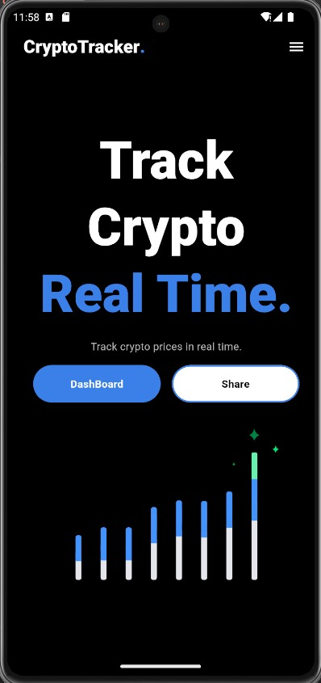
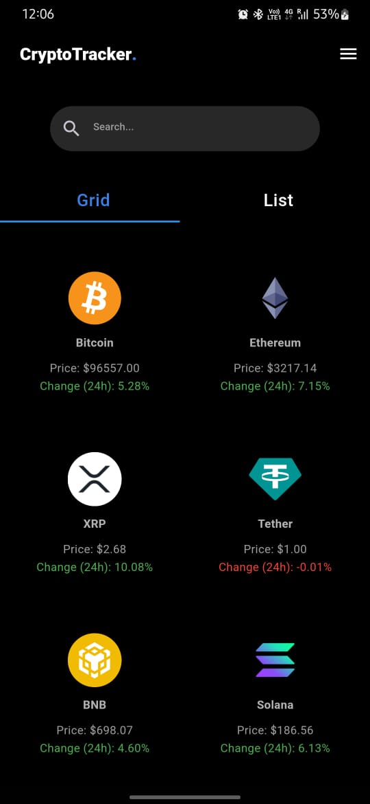

# Crypto Compare App

## Overview
The **Crypto Compare App** is a Flutter-based application that enables users to explore and compare various cryptocurrencies dynamically fetched from the CoinGecko API. The app provides detailed descriptions and facilitates side-by-side comparisons of selected currencies, offering a user-friendly interface and seamless experience.

## Features
- **Dynamic Data Fetching**: Retrieve real-time cryptocurrency data, including name, symbol, current price, market cap, and 24-hour price changes.
- **Side-by-Side Comparison**: Select any two cryptocurrencies from the list to compare their details side-by-side.
- **Dropdown Interface**: Easy-to-use dropdown menus for selecting cryptocurrencies.
- **Reusable Widgets**: Clean and modular design with reusable components for currency descriptions.

## Technologies Used
- **Flutter**: Framework for building the UI.
- **Dart**: Programming language for app logic.
- **CoinGecko API**: Source for cryptocurrency data.
- **HTTP Package**: For making API requests.

## Installation
1. **Clone the Repository**:
   ```bash
   git clone https://github.com/your-username/crypto-compare-app.git
   cd crypto-compare-app
   ```

2. **Install Dependencies**:
   ```bash
   flutter pub get
   ```

3. **Run the App**:
   ```bash
   flutter run
   ```

## API Integration
This app uses the CoinGecko API to fetch cryptocurrency data. The API provides details like:
- Name and symbol of the cryptocurrency
- Current price and 24-hour price change
- Market cap and rank

**API Endpoint**: 
```
https://api.coingecko.com/api/v3/coins/markets?vs_currency=usd&order=market_cap_desc&per_page=100&page=1&sparkline=false
```

## Folder Structure
```
crypto-compare-app/
|-- lib/
|   |-- main.dart               # Entry point of the application
|   |-- compare_screen.dart     # Screen for comparing cryptocurrencies
|   |-- crypto.dart             # Model class for cryptocurrency data
|   |-- fetch_crypto_data.dart  # API fetch logic
|-- pubspec.yaml                # Flutter dependencies
```

## Screenshots



## Future Enhancements
- **Search Functionality**: Allow users to search for specific cryptocurrencies.
- **Favorites**: Save and quickly access frequently compared currencies.
- **Graphical Data**: Display price trends over time with graphs.

## Contributions
Contributions are welcome! Feel free to open issues or submit pull requests to improve the app.

## License
This project is licensed under the MIT License. See the `LICENSE` file for details.

## Acknowledgments
- [CoinGecko API](https://www.coingecko.com/en/api) for real-time cryptocurrency data.
- Flutter community for providing extensive documentation and support.
